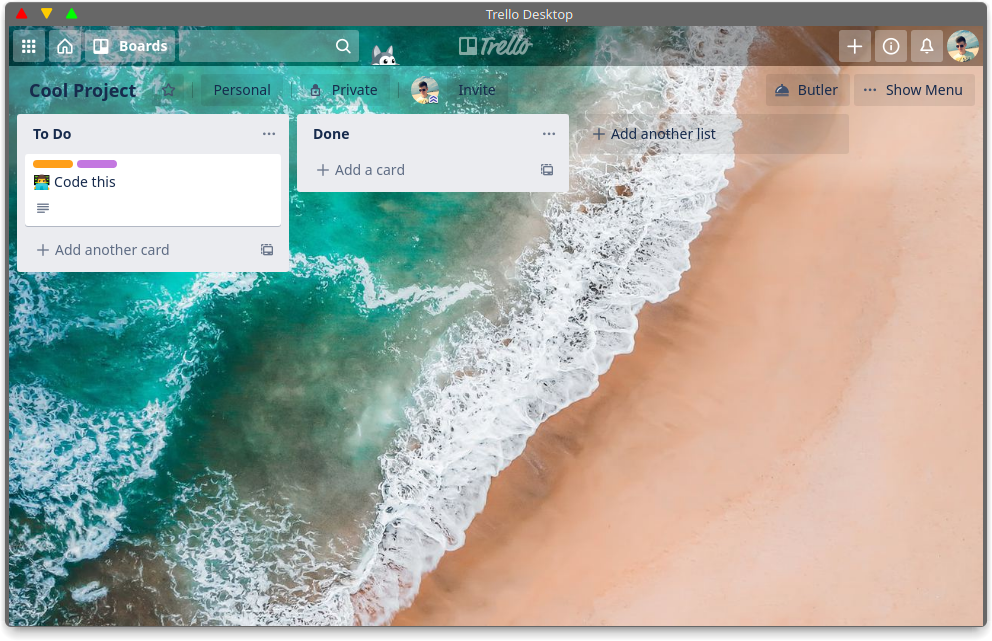

    

# Trello Linux Desktop

This is an unofficial port of Trello web app to linux executable format. This way you can use trello on your machine without having to use browser.

## Download

You can download latest release in github releases. Two formats are available - regular *.tar.gz* and *.deb*
